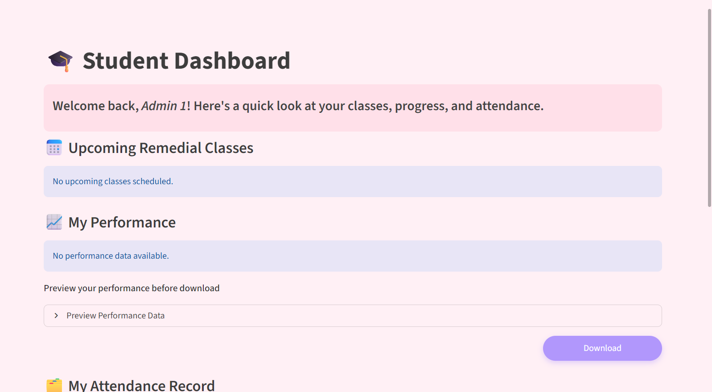
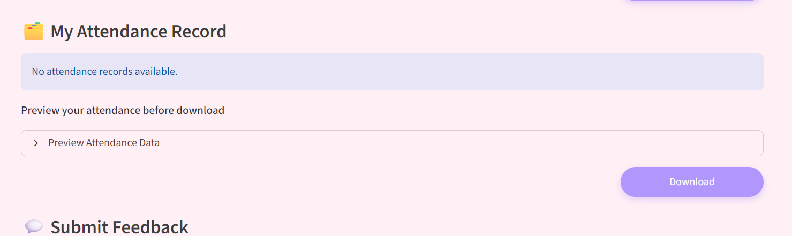
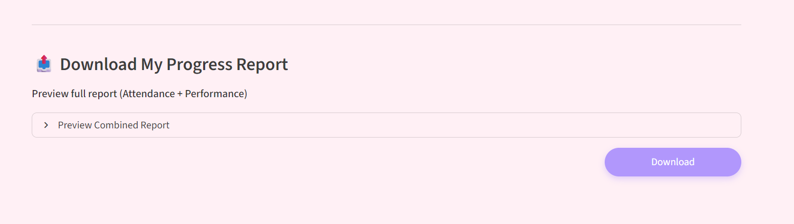

# 🎓 Remedial Class Management System

A role-based web application for managing remedial classes in schools or colleges. Built using **Streamlit**, **SQLite3**, and **Plotly** for interactive dashboards.

---

## 🚀 Features

### 🔐 Authentication
- Register and login with hashed passwords
- Role-based redirection after login (Admin / Teacher / Student)

### 🧑‍💼 Admin Dashboard
- Manage users (students & teachers)
- Schedule remedial classes
- View all attendance and performance data

### 👨‍🏫 Teacher Dashboard
- View assigned classes
- Mark student attendance
- Record performance (before/after remedial)

### 👩‍🎓 Student Dashboard
- View upcoming classes (calendar view)
- Visualize performance improvement
- Track attendance rate
- Submit feedback on classes
- Preview and download attendance or performance data as CSV
- Export complete progress reports as PDF


---

## 🛠️ Tech Stack

| Tech | Purpose |
|------|---------|
| [Streamlit](https://streamlit.io) | UI and dashboard interface |
| `sqlite3` | Lightweight database |
| `pandas` | Data manipulation |
| `plotly` | Interactive performance charts |
| `streamlit-calendar` | Calendar integration for classes |

---

## 📁 Folder Structure

```
.
├── app.py                  # Entry point
├── home.py                 # Role-based dashboard redirect
├── remedial_db.py          # Creates all DB tables
├── utils/
│   ├── auth.py             # Login & register logic
│   └── db_ops.py           # All DB interaction functions
├── pages/
│   ├── 1_Admin_Dashboard.py
│   ├── 2_Teacher_Dashboard.py
│   └── 3_Student_Dashboard.py
└── README.md               # You're here!
```

---

## ⚙️ Setup Instructions

1. **Clone the repo**
   ```bash
   git clone https://github.com/your-username/remedial-class-manager.git
   cd remedial-class-manager
   ```

2. **Install dependencies**
   ```bash
   pip install streamlit pandas plotly streamlit-calendar
   ```

3. **Initialize the database**
   ```bash
   python remedial_db.py
   ```

4. **Run the app**
   ```bash
   streamlit run app.py
   
> Once the app is running, log in as a **Student**.  
> You can now **preview and download** your performance, attendance, or complete progress report directly from your dashboard.
   

---

## 🧪 Sample Users (optional)
> You can pre-fill users using `remedial_db.py` or by registering directly in the app.

---

## 📌 Credits

Built with ❤️ for a DBMS course project.

---

## 🧼 To-Do / Enhancements

- [ ] Email notifications
- [ ] UI polish with custom themes
- [ ] Admin activity logs

---

## 📸 Screenshots (Optional)

> Add screenshots of dashboards if submitting/presenting

**🎓 Student Dashboard – Download Progress Report Section**
This section allows students to preview and download their academic progress reports directly from the dashboard in different formats (CSV/PDF).  
It includes three subsections:
1. **Performance Section** – Preview and download performance data.
2. **Attendance Section** – View attendance history and export attendance report.
3. **Full Report Section** – Combined export of attendance and performance in a single PDF.

## 📈 Performance Section


## 🗂️ Attendance Section


## 📤 Full Report Section



---

## 📜 License

MIT License (or whichever you choose)
